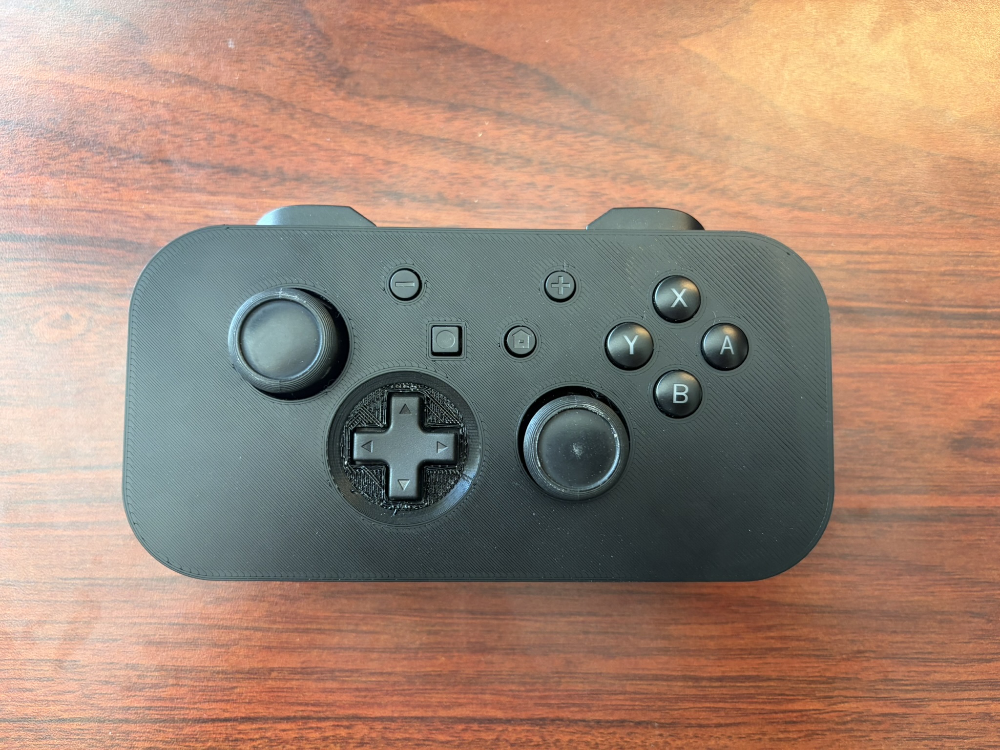
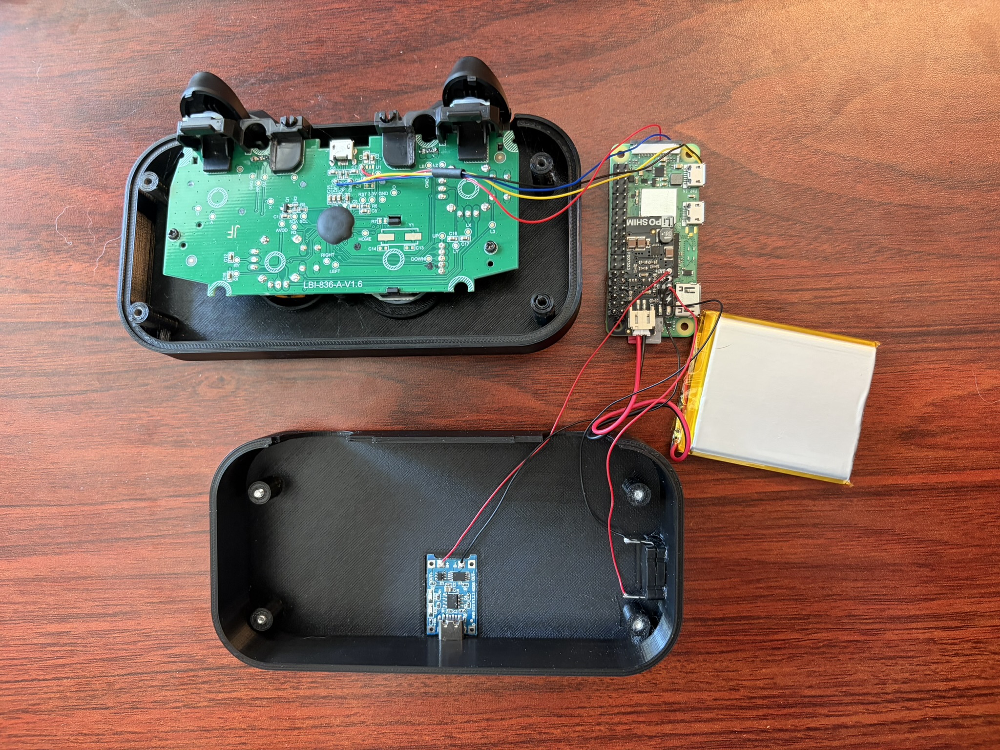
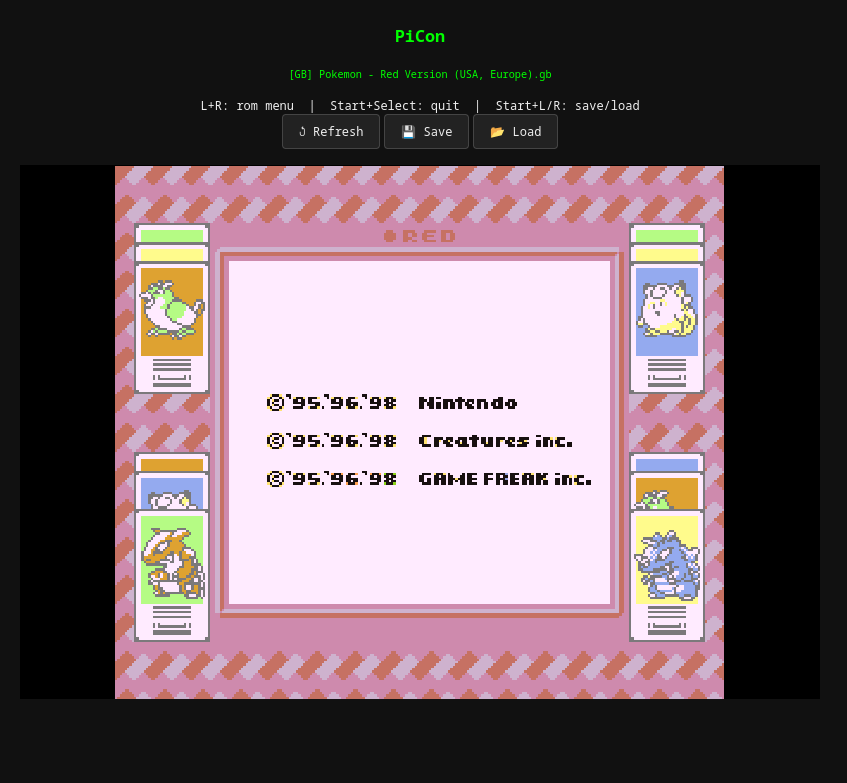

# PiCon

> A handheld retro gaming console built inside a PowerA wired Switch controller shell, powered by a Raspberry Pi Zero 2W and Nostalgist.js.

<p align="center">
  
</p>

<p align="center">
  
</p>

<p align="center">
  
</p>

---

## Overview

PiCon repurposes a PowerA wired Switch controller as the shell for a self-contained retro gaming handheld. The Pi Zero 2W hosts a local web server running [Nostalgist.js](https://nostalgist.js.org/) - a browser-based wrapper for Libretro/RetroArch cores - and broadcasts a WiFi access point so any nearby device can connect and play. A WebSocket relay bridges physical controller input from the original PCB's USB test pads directly into the emulator.

Power is managed by a Pimoroni LiPo SHIM paired with a TP4056 charging board and a 2500mAh LiPo, with a latching push switch controlling the EN pin to toggle power.

---

## Materials

| Component | Notes |
|---|---|
| PowerA wired Switch controller | Donor shell and button PCB |
| Raspberry Pi Zero 2W | Main compute |
| Pimoroni LiPo SHIM | Power management |
| 2500mAh LiPo battery | JST 2mm connector |
| TP4056 charging board | USB-C charging input |
| Latching push switch | SPST, wired EN→GND |

---

## Software

| File | Purpose |
|---|---|
| `controller.py` (systemd service) | Reads controller input via evdev and relays it over WebSocket; handles safe-shutdown combos |
| `server.py` (systemd service) | Serves the local Nostalgist.js web app on port 8080 |
| `index.html` | Frontend loaded by the player's browser; connects to the WebSocket relay and drives emulation |

### Key behaviors

- **WiFi AP** - Pi broadcasts `PiCon` SSID at `10.0.0.1` via NetworkManager + dnsmasq. No internet required.
- **ROM browser** - `L+R` opens the ROM selection menu in-emulator.
- **Save/load states** - `Start+L` / `Start+R`.
- **Safe shutdown** - Hold Start and Select for 2 seconds; the controller service catches this via asyncio and calls `sudo shutdown -h now`.
- **Low battery shutdown** - GPIO 4 monitors the SHIM's low-battery signal at 3.4V and triggers an automatic safe shutdown.

---

## Construction

### Shell prep

Disassemble the PowerA controller and remove all buttons. The original button caps need their center posts trimmed - only the East/West keys are modeled in the new shell, so only those posts need to remain full height. Print button extensions for all buttons; the new shell seats the PCB slightly deeper than stock to achieve a flat front face for cleaner printing, so extensions are required to bring all buttons flush.

### Assembly order

1. **Top shell** - Reseat the button PCB with extensions installed and screw down pcb using original screws from the Power A shell.
2. **Mid frame** - Secure the LiPo battery and Pi Zero 2W. Route antenna away from the PCB edge (the Pi's PCB trace antenna sits near the USB port corner - keep metal and wiring clear of that area to avoid RF interference).
3. **Bottom shell** - Slot the latching switch into its cutout and solder two wires to its terminals. Press-fit the TP4056 board into its recess so the USB-C port sits flush with the exterior cutout. Assemble final shell with controller face downwards.  Secure the shell together with four M3x14mm machine screws.

---

## Wiring

```
LiPo battery (JST 2mm)
    └── Pimoroni LiPo SHIM (VBAT / GND)
            ├── EN pin ──── Latching switch ──── GND   (switch closes EN to GND to power on)
            └── BAT+ / GND pads ──── TP4056 BAT+ / BAT−

PowerA controller USB test pads ──── Pi Zero 2W USB test pads (D+, D−, VBUS, GND)

Pi GPIO 4 ──── LiPo SHIM low-battery signal (active at ~3.4V)
```

> **Note:** The SHIM's EN pin floats high by default (Pi is on). The switch must pull EN **to GND** - do **not** wire it to VBAT+.

---

## Adding ROMs

ROMs live on the Pi at:

```
~/web/roms/<SYSTEM_NAME>/<ROM_FILE>.<EXT>
```

Example:
```
~/web/roms/gba/pokemon_emerald.gba
```

Copy files over SSH:
```bash
scp my_rom.gba pi@10.0.0.1:~/web/roms/gba/
# or
rsync -av roms/ pi@10.0.0.1:~/web/roms/
```

Or pull the SD card directly and copy to the `roms/` directory on the card.

> **Note:** For obvious reasons I will not be providing direct downloads or links to any roms.

---

## Libretro Cores

Nostalgist.js loads Libretro cores locally. Cores must be present at:

```
~/web/cores/<core_name>.js   # and associated .wasm if applicable
```

Cores can be downloaded from [RetroArch's core repository](https://buildbot.libretro.com/nightly/). The default GBA core used is **mgba**.

> Skipping this step will cause ROM loading to fail silently.

---

## Setup

1. **Flash Raspberry Pi OS Lite 64-bit** to your SD card (Pi Imager recommended).
2. **Configure the WiFi AP** using NetworkManager:
   ```bash
   nmcli con add type wifi ifname wlan0 con-name PiCon autoconnect yes ssid PiCon
   nmcli con modify PiCon 802-11-wireless.mode ap 802-11-wireless.band bg ipv4.method shared ipv4.addresses 10.0.0.1/24
   nmcli con up PiCon
   ```
3. **Transfer files** - copy `controller.py`, `server.py`, `index.html`, your cores, and ROMs to the Pi.
4. **Install systemd services** - place unit files in `/etc/systemd/system/` and enable them:
   ```bash
   sudo systemctl enable controller.service server.service
   sudo systemctl start controller.service server.service
   ```
5. **Connect** - join the `PiCon` WiFi network from any device and navigate to `http://10.0.0.1:8080`.

---

## Credits

This project was inspired by [Abe's Projects](https://github.com/abeisgoat) and his YouTube video [*I built a magic SNES controller*](https://www.youtube.com/watch?v=5nB09pXS-Mo), in which he built a self-contained retro gaming controller using a Pi and a browser-based emulator. In his original video using his QT py, he mentioned controller inputs being laggy in longer play sessions.  I felt I could improve upon what he started by using a more powerful board like the Zero 2W.

---

## License

MIT
